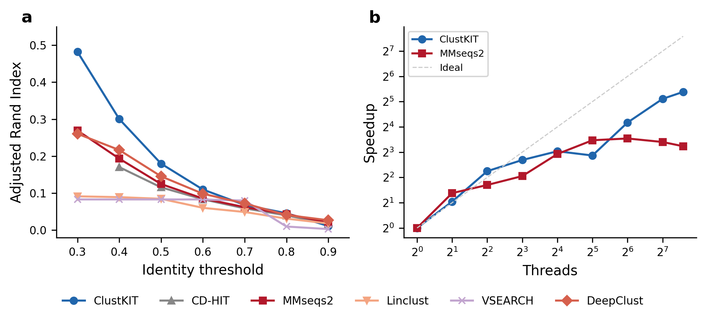

^^^^^

ClustKIT is an accurate protein sequence clustering tool that combines MinHash sketching, locality-sensitive hashing (LSH), banded Smith-Waterman alignment with BLOSUM62 scoring, and Leiden community detection to achieve high clustering accuracy at all identity thresholds, including the challenging low-identity regime (30-50%) where greedy heuristic methods lose sensitivity.

If you found ClustKIT useful, please cite *ClustKIT: GPU-accelerated protein sequence clustering with locality-sensitive hashing and community detection*. Steenwyk et al. 2026.

**(a)** Clustering accuracy (Adjusted Rand Index) across identity thresholds on the Pfam benchmark (22,343 sequences, 56 families). ClustKIT achieves nearly twice the ARI of existing tools at low identity thresholds (t = 0.3). **(b)** Thread scaling: ClustKIT achieves 41.8x speedup at 192 threads.

|

Quick Start
-----------
These two lines represent the simplest method to rapidly install and run ClustKIT.

.. code-block:: shell

	# install
	pip install clustkit
	# run
	clustkit cluster -i proteins.fasta -o output/ -t 0.5 --threads 8

Below are more detailed instructions, including alternative installation methods.

**1) Installation**

To help ensure ClustKIT can be installed using your favorite workflow, ClustKIT is available from pip and source.

**Install from pip**

To install from pip, use the following commands:

.. code-block:: shell

	# create virtual environment
	python -m venv venv
	# activate virtual environment
	source venv/bin/activate
	# install clustkit
	pip install clustkit

**Note: the virtual environment must be activated to use clustkit.**

|

**Install from pip with GPU support**

To install with GPU-accelerated Smith-Waterman alignment (requires CUDA 12.x):

.. code-block:: shell

	pip install clustkit[gpu]

|

**Install from source**

Similarly, to install from source, we strongly recommend using a virtual environment. To do so, use the following commands:

.. code-block:: shell

	# download
	git clone https://github.com/JLSteenwyk/ClustKIT.git
	cd ClustKIT/
	# create virtual environment
	python -m venv venv
	# activate virtual environment
	source venv/bin/activate
	# install
	pip install -e ".[dev]"

To deactivate your virtual environment, use the following command:

.. code-block:: shell

	# deactivate virtual environment
	deactivate

**Note: the virtual environment must be activated to use clustkit.**

|

**2) Usage**

To use ClustKIT in its simplest form, execute the following command:

.. code-block:: shell

	clustkit cluster -i proteins.fasta -o output/

Output files:

- ``output/clusters.tsv`` -- Cluster assignments (sequence_id, cluster_id, is_representative)
- ``output/representatives.fasta`` -- Representative sequences
- ``output/run_info.json`` -- Run parameters and statistics

|

^^^^

.. toctree::
	:maxdepth: 4

	about/index
	advanced/index
	tutorials/index
	change_log/index
	other_software/index
	frequently_asked_questions/index

^^^^
